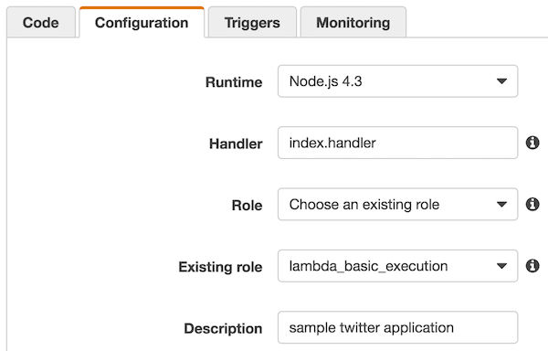

# lambda-es2015-twitter-bot

This is an example to create an AWS Lambda application of Babel-based ES2015. This application simply tweet the current time.

## Installation

```
git clone https://github.com/hkusu/lambda-es2015-twitter-bot
npm install
```

Get the keys of your twitter application in [https://apps.twitter.com](https://apps.twitter.com).

> Permission, please choose `Read and Write`.

Set the keys to the `Twitter.js`.

```Twitter.js
...

twit = new Twit({
  consumer_key: 'your consumer key',
  consumer_secret: 'your consumer secret',
  access_token: 'your access token',
  access_token_secret: 'your access token secret',
})

...
```

## Usage

### check the syntax

```
npm run lint
```

### generate the archive

```
npm run build
```

Upload the generated index.zip in the console of the AWS Lambda.

## Setting of AWS Lambda



> Role, does not require special permissions.

Triggers, select the `CloudWatch Events(Schedule)`.
