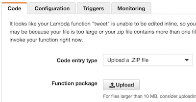
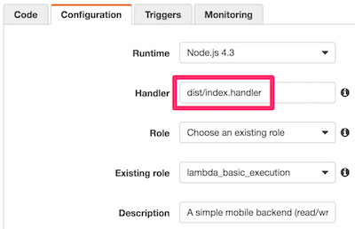

# lambda-es2015-twitter-bot

This is an example to create an AWS Lambda application with Babel-based ES2015. This application simply tweet the current weather.

> Using [livedoor Weather Hacks](http://weather.livedoor.com/weather_hacks/).

## Installation

    git clone https://github.com/hkusu/lambda-es2015-twitter-bot
    npm install

Get the keys of your twitter application in [https://apps.twitter.com](https://apps.twitter.com).

> Permission, please choose `Read and Write`.

Set the keys to the `.env` file.

    CONSUMER_KEY = your consumer key
    CONSUMER_SECRET = your consumer secret
    ACCESS_TOKEN = your access token
    ACCESS_TOKEN_SECRET = your access token secret
    CITY = 130010

> `CITY` code, find from [primary_area.xml](http://weather.livedoor.com/forecast/rss/primary_area.xml).

## Usage

### check the syntax of source code

    npm run lint

### monitoring and automated build of source code

    npm run watch

### run the application in the local environment

    npm run localRun

### create an archive

    npm run build

Upload the created app.zip in the console of the AWS Lambda.

## Settings in the AWS lambda

> Role, does not require special permissions.

Triggers, select the `CloudWatch Events(Schedule)`. Or, if you can add a parameter to the event(ex: API Gateway), it is possible to pass the city as follows:

    {
      "city": 471030
    }
